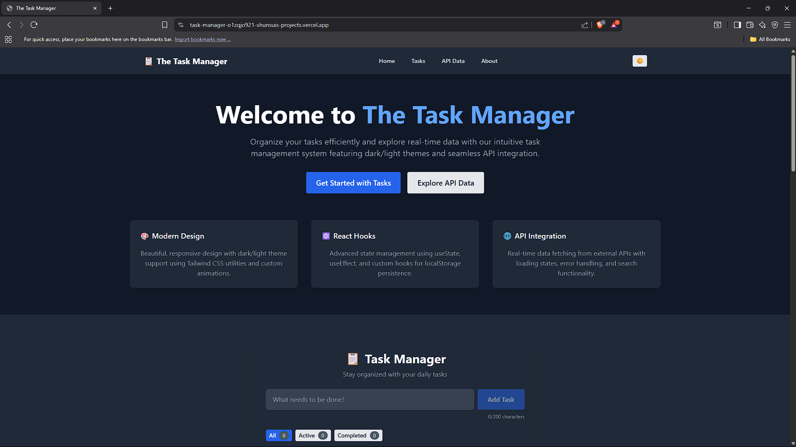
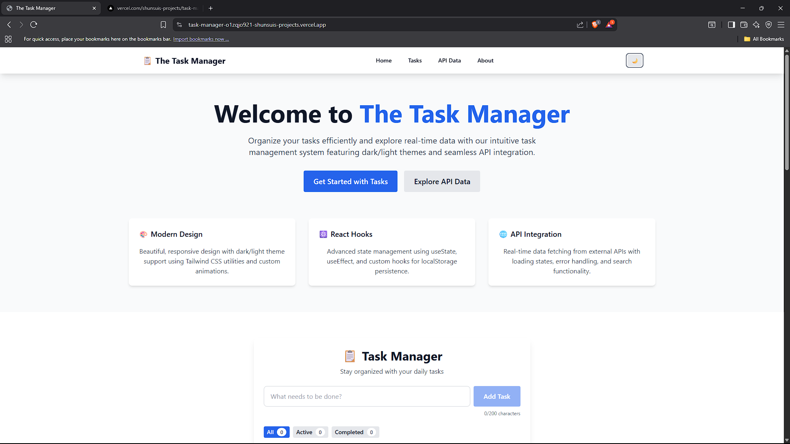
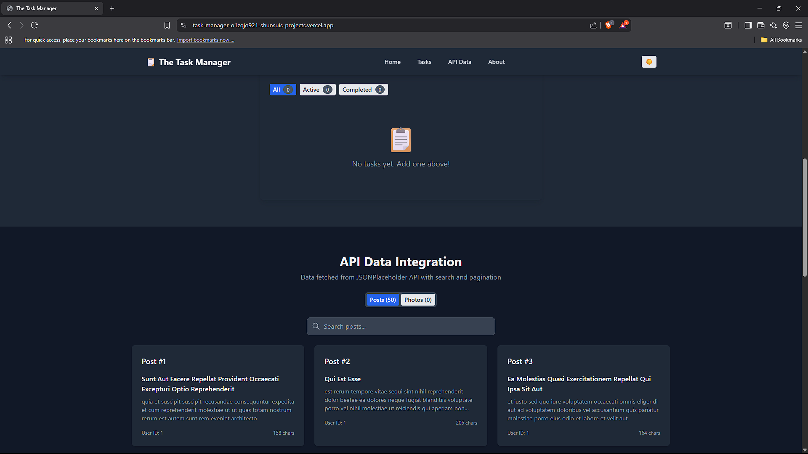
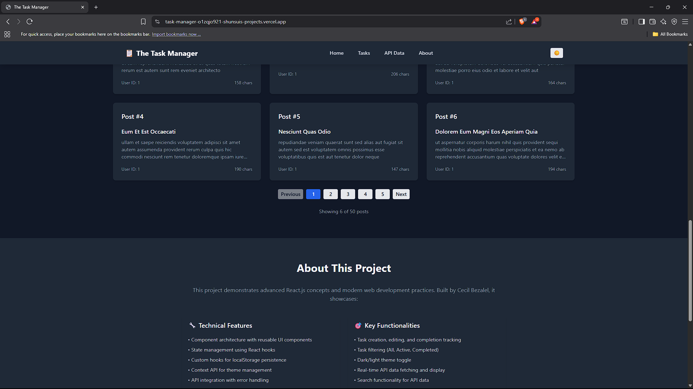
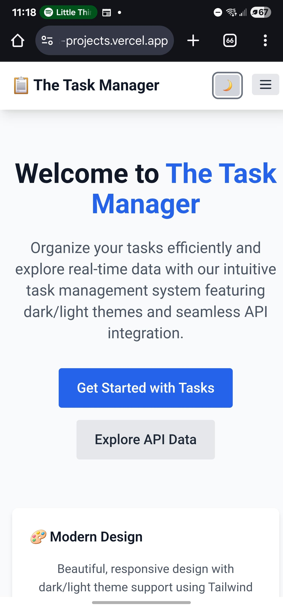
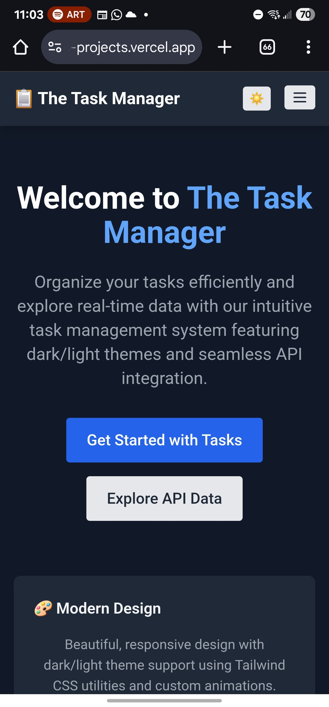
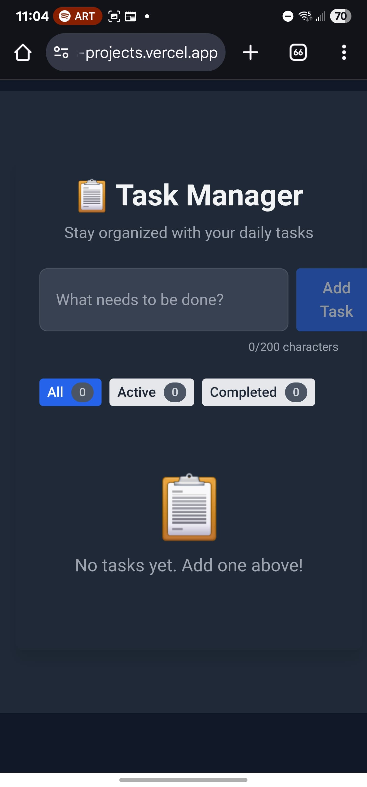
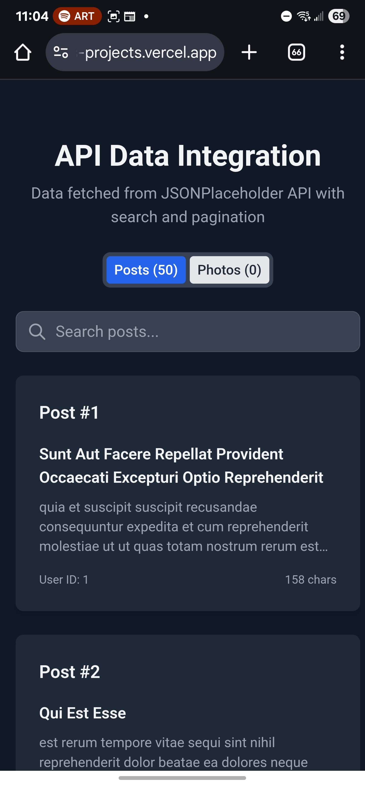

[](https://classroom.github.com/online_ide?assignment_repo_id=19894973&assignment_repo_type=AssignmentRepo)

# 📋 The Task Manager - React.js & Tailwind CSS

A modern, responsive React application showcasing advanced component architecture, state management with hooks, API integration, and beautiful Tailwind CSS styling with dark/light theme support. Built by Cecil Bezalel.

## 🌟 Live Demo

🚀 **Live Application**: [https://task-manager-o1zqjo921-shunsuis-projects.vercel.app/](https://task-manager-o1zqjo921-shunsuis-projects.vercel.app/)

*Local Development*: [http://localhost:3000](http://localhost:3000) (after running `npm run dev`)

## 📸 Screenshots

### 💻 Desktop/Laptop Views

#### 🏠 Home Page (Dark Theme)

*Welcome page with animated hero section and feature cards on desktop - Dark theme*

#### 🏠 Home Page (Light Theme)

*Welcome page with animated hero section and feature cards on desktop - Light theme*

#### 📋 Task Management Interface (Dark Theme)

*Task creation, editing, filtering, and progress tracking on desktop - Dark theme*

#### 🌐 API Data Display (Dark Theme)

*Real-time posts from JSONPlaceholder API with search and pagination on desktop - Dark theme*

#### 🌙 Dark Mode Theme

*Application in dark mode showing theme consistency on desktop*

### 📱 Mobile/Phone Views

<div style="display: grid; grid-template-columns: repeat(auto-fit, minmax(200px, 1fr)); gap: 20px; margin: 20px 0;">

<div style="text-align: center;">
<h5>📱 Light Theme</h5>

<p><em>Mobile responsive design - Light theme</em></p>
</div>

<div style="text-align: center;">
<h5>🌙 Dark Theme - View 1</h5>

<p><em>Mobile responsive design - Dark theme</em></p>
</div>

<div style="text-align: center;">
<h5>🌙 Dark Theme - View 2</h5>

<p><em>Task management interface</em></p>
</div>

<div style="text-align: center;">
<h5>🌙 Dark Theme - View 3</h5>

<p><em>API data display</em></p>
</div>

<div style="text-align: center;">
<h5>🌙 Dark Theme - View 4</h5>

<p><em>Navigation menu</em></p>
</div>

<div style="text-align: center;">
<h5>🌙 Dark Theme - View 5</h5>

<p><em>Task filtering</em></p>
</div>

<div style="text-align: center;">
<h5>🌙 Dark Theme - View 6</h5>

<p><em>Search functionality</em></p>
</div>

<div style="text-align: center;">
<h5>🌙 Dark Theme - View 7</h5>

<p><em>Pagination controls</em></p>
</div>

<div style="text-align: center;">
<h5>🌙 Dark Theme - View 8</h5>

<p><em>About section</em></p>
</div>

<div style="text-align: center;">
<h5>🌙 Dark Theme - View 9</h5>

<p><em>Footer section</em></p>
</div>

<div style="text-align: center;">
<h5>🌙 Dark Theme - View 10</h5>

<p><em>Component interactions</em></p>
</div>

<div style="text-align: center;">
<h5>🌙 Dark Theme - View 11</h5>

<p><em>Complete mobile experience</em></p>
</div>

</div>

> **Screenshots Overview**: 
> - **Desktop Views**: 4 dark theme screenshots (1.png - 4.png) + 1 light theme (1_light.png)
> - **Mobile Views**: 10 dark theme screenshots (5.jpg, 6.jpg - 15.jpg) + 1 light theme (5_light.jpg)
> - **Theme Comparison**: Both light and dark themes showcased on desktop and mobile
> - **Comprehensive Coverage**: Complete responsive design demonstration across devices and themes

## 🎯 Assignment Overview

This project fulfills all requirements for the Week 3 React.js assignment and demonstrates advanced React development skills:

### ✅ Completed Tasks

1. **Project Setup** ✓
   - ✅ React application with Vite
   - ✅ Tailwind CSS configuration
   - ✅ Organized project structure
   - ✅ Development environment setup

2. **Component Architecture** ✓
   - ✅ Button component with multiple variants
   - ✅ Footer component with links and social media
   - ✅ Card components (regular, image, simple variants)
   - ✅ Navbar with responsive mobile menu
   - ✅ Layout components with proper structure

3. **State Management & Hooks** ✓
   - ✅ TaskManager with full CRUD operations
   - ✅ useState for component state management
   - ✅ Custom hook `useLocalStorage` for persistence
   - ✅ Custom hook `useTaskStorage` for task management
   - ✅ Context API for theme management

4. **API Integration** ✓
   - ✅ JSONPlaceholder API integration
   - ✅ Loading and error states
   - ✅ Search functionality
   - ✅ Pagination implementation
   - ✅ Multiple data types (posts, photos)

5. **Tailwind CSS Styling** ✓
   - ✅ Responsive design (mobile, tablet, desktop)
   - ✅ Dark/light theme switcher
   - ✅ Custom animations and transitions
   - ✅ Utility-first CSS approach
   - ✅ Custom component classes

## 🚀 Features

### 📱 Core Functionality
- **Task Management**: Create, edit, complete, and delete tasks
- **Task Filtering**: View all, active, or completed tasks
- **Progress Tracking**: Visual progress bar and statistics
- **Data Persistence**: Tasks saved to localStorage
- **Theme Switching**: Toggle between light and dark modes

### 🌐 API Integration
- **Real-time Data**: Fetch posts and photos from JSONPlaceholder
- **Search Capability**: Filter posts by title and content
- **Pagination**: Navigate through large datasets
- **Error Handling**: Graceful error states and retry functionality

### 🎨 UI/UX
- **Responsive Design**: Works on all screen sizes
- **Smooth Animations**: CSS transitions and custom keyframes
- **Accessibility**: ARIA labels and keyboard navigation
- **Modern Interface**: Clean, intuitive design

## 🛠️ Technologies Used

### Frontend Stack
- **React 18.2** - Component-based UI library
- **Vite 5.0** - Fast build tool and dev server
- **Tailwind CSS 3.3** - Utility-first CSS framework
- **JavaScript ES6+** - Modern JavaScript features

### Development Tools
- **ESLint** - Code linting and formatting
- **PostCSS** - CSS processing
- **Autoprefixer** - CSS vendor prefixing

### APIs & External Services
- **JSONPlaceholder** - Mock REST API for testing
- **DummyJSON** - Alternative API endpoints

## 📦 Installation & Setup

### Prerequisites
- Node.js (v18 or higher)
- npm or yarn package manager
- Modern web browser (Chrome, Firefox, Safari, Edge)

### Quick Start

1. **Clone the repository**
   ```bash
   git clone [your-repo-url]
   cd week-3-react-js-assignment-shunsui254
   ```

2. **Install dependencies**
   ```bash
   npm install
   ```

3. **Start development server**
   ```bash
   npm run dev
   ```

4. **Open in browser**
   - Navigate to `http://localhost:3000`
   - The application will open automatically

### Available Scripts

```bash
# Development
npm run dev          # Start development server
npm run build        # Build for production
npm run preview      # Preview production build
npm run lint         # Run ESLint
```

## 📁 Project Structure

```
src/
├── components/          # Reusable UI components
│   ├── Button.jsx      # Multi-variant button component
│   ├── Card.jsx        # Card layouts (regular, image, simple)
│   ├── Footer.jsx      # Site footer with links
│   ├── Navbar.jsx      # Navigation with mobile menu
│   ├── TaskManager.jsx # Complete task management
│   └── ApiDataDisplay.jsx # API data with search/pagination
├── context/            # React Context providers
│   └── ThemeContext.jsx # Theme management (light/dark)
├── hooks/              # Custom React hooks
│   └── useLocalStorage.js # localStorage and task management
├── api/                # API integration layer
│   └── jsonPlaceholder.js # External API calls
├── utils/              # Utility functions
│   └── index.js        # Helper functions and utilities
├── pages/              # Page-level components (future)
├── App.jsx             # Main application component
├── main.jsx            # Application entry point
└── index.css           # Global styles and Tailwind imports
```

## 🎨 Design System

### Color Palette
- **Primary**: Blue (600-700)
- **Secondary**: Gray (200-800)
- **Success**: Green (600-700)
- **Warning**: Yellow (500-600)
- **Danger**: Red (600-700)

### Typography
- **Font Family**: System font stack
- **Headings**: Bold weights (600-700)
- **Body Text**: Regular weight (400)

### Responsive Breakpoints
```css
sm: 640px    /* Mobile landscape */
md: 768px    /* Tablet */
lg: 1024px   /* Desktop */
xl: 1280px   /* Large desktop */
```

## 🔧 Configuration

### Tailwind CSS
The project uses a custom Tailwind configuration with:
- Dark mode support (`class` strategy)
- Custom animations (fadeIn, slideUp)
- Extended color palette
- Custom component utilities

### Vite Configuration
- React plugin enabled
- Development server on port 3000
- Auto-browser opening
- Hot module replacement (HMR)

## 📚 Component Documentation

### Button Component
```jsx
<Button 
  variant="primary|secondary|danger|success|warning"
  size="sm|md|lg"
  disabled={false}
  onClick={handleClick}
>
  Button Text
</Button>
```

### Card Component
```jsx
<Card 
  title="Card Title"
  actions={<Button>Action</Button>}
  hover={true}
  size="sm|md|lg"
>
  Card content
</Card>
```

### TaskManager Component
```jsx
<TaskManager />
// Self-contained task management with localStorage
```

## 🌐 API Integration

### JSONPlaceholder Endpoints
- `GET /posts` - Fetch blog posts
- `GET /photos` - Fetch photo gallery
- `GET /users` - Fetch user data
- `GET /comments` - Fetch post comments

### Error Handling
```javascript
try {
  const data = await fetchPosts();
  setData(data);
} catch (error) {
  setError('Failed to fetch data');
  console.error(error);
}
```

## 🎯 Performance Features

- **Lazy Loading**: Images load on demand
- **Debounced Search**: Reduces API calls
- **Pagination**: Efficient data display
- **Memoization**: Optimized re-renders
- **Code Splitting**: Fast initial load

## 🔍 Testing the Application

### Manual Testing Checklist

#### Task Management
- [ ] Add new tasks
- [ ] Mark tasks as complete
- [ ] Edit existing tasks
- [ ] Delete tasks
- [ ] Filter by status (all/active/completed)
- [ ] Clear completed tasks
- [ ] Verify localStorage persistence

#### Theme System
- [ ] Toggle light/dark mode
- [ ] Verify theme persistence
- [ ] Check system preference detection

#### API Integration
- [ ] Load posts and photos
- [ ] Search posts by keyword
- [ ] Navigate pagination
- [ ] Handle network errors
- [ ] Verify loading states

#### Responsive Design
- [ ] Mobile layout (< 768px)
- [ ] Tablet layout (768px - 1024px)
- [ ] Desktop layout (> 1024px)
- [ ] Navigation menu on mobile

## 🚀 Deployment

### Building for Production

1. **Create production build**
   ```bash
   npm run build
   ```

2. **Preview production build**
   ```bash
   npm run preview
   ```

### Deployment Options

#### Vercel (Recommended)
```bash
# Install Vercel CLI
npm i -g vercel

# Deploy
vercel --prod
```

#### Netlify
```bash
# Build and deploy
npm run build
# Upload dist/ folder to Netlify
```

#### GitHub Pages
```bash
# Add to package.json
"homepage": "https://yourusername.github.io/repo-name"

# Install gh-pages
npm install --save-dev gh-pages

# Add deploy script
"deploy": "gh-pages -d dist"

# Deploy
npm run build
npm run deploy
```

## 🤝 Contributing

This is a learning project for PLP Academy. If you're a fellow student:

1. Fork the repository
2. Create a feature branch
3. Make your changes
4. Test thoroughly
5. Submit a pull request

## 📝 Assignment Submission

### Checklist Before Submission
- [ ] All components working correctly
- [ ] No console errors
- [ ] Responsive design tested
- [ ] API integration functional
- [ ] Code properly documented
- [ ] README updated with features

### Submission Files
- Complete source code in `src/`
- `package.json` with all dependencies
- `README.md` with setup instructions
- Live demo URL (if deployed)

## 🎓 Learning Outcomes

Through this project, I've demonstrated:

- **React Fundamentals**: Components, props, state, lifecycle
- **Modern Hooks**: useState, useEffect, custom hooks
- **State Management**: Context API, localStorage persistence
- **API Integration**: Fetch, async/await, error handling
- **CSS Frameworks**: Tailwind CSS, responsive design
- **Development Tools**: Vite, ESLint, npm scripts
- **Best Practices**: Component composition, code organization

## 📞 Support

If you encounter any issues:

1. Check the [Issues](../../issues) page
2. Review the console for error messages
3. Verify all dependencies are installed
4. Ensure Node.js version compatibility

## 📄 License

This project is created for educational purposes to demonstrate React.js development skills.

## 🙏 Acknowledgments

- **React Team** - For the powerful UI library
- **Tailwind CSS Team** - For the amazing utility-first framework
- **Vite Team** - For the lightning-fast build tool
- **JSONPlaceholder** - For providing free testing APIs
- **Open Source Community** - For the incredible ecosystem of tools and libraries

---

**Made with ❤️ by Cecil Bezalel**

*Last updated: July 2025*
